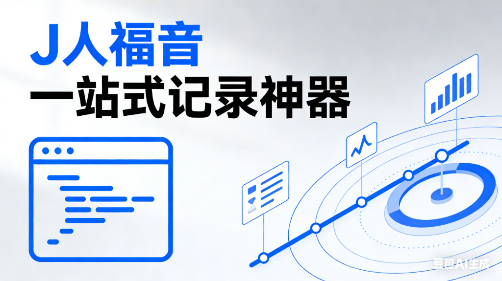

# Logs2Weekly (AI Productivity Hub)

> **J 人福音｜专为计划型、条理型用户打造的轻量记录工具**  
> 🌐 **公网访问地址**: [https://logs2weekly.chunyu2026.dpdns.org/](https://logs2weekly.chunyu2026.dpdns.org/)

---

## 📖 简介 (Introduction)

**Logs2Weekly** 是一款“随手记日志，自动生成周报”的零负担工作记录工具。

如果你每天被琐碎工作占据，需要频繁切换待办、备忘录、笔记软件来记录任务、临时事项和工作内容，这款工具能一站式解决你的问题。我们主打**极速记录**与**自动整理**，帮你把零散的日志自动转化为结构化的周报与工作复盘。

### 🚀 Slogan

**想到就记，自动整理，轻松复盘。**

---

## 🤕 用户痛点 (Pain Points)

- 😫 **记录分散**：待办在 Todoist，灵感在备忘录，日报在文档，只有混乱没有沉淀。
- 🤯 **整理负担**：每周写周报时都要翻找聊天记录和日历，痛苦不堪。
- 📉 **缺乏复盘**：忙碌了一周却不知道产出了什么，缺乏可视化的进度反馈。

---

## ✨ 核心特性 (Key Features)

- **⚡ 极速记录**：想到就写，支持 Markdown，无需排版、无需关心时间格式。
- **🤖 自动聚合**：每日 18:00 自动按日期聚合任务与日志，智能整理归档。
- **📊 智能周报**：一键生成复盘内容（执行摘要、重点回顾、下周建议），直接用于汇报。
- **✅ 一体化管理**：待办事项 (Task) + 工作日志 (Log) + 临时灵感 (Idea) 统一收纳。
- **🎨 可视化洞察**：
  - **动态问候**：根据时间段给您温暖的问候。
  - **活跃度热力图**：直观展示每日投入度。
  - **Topic 统计**：自动分析您最关注的工作领域。

---

## 🧠 设计理念 (Philosophy)

> **少一点操作，多一点思考。**  
> **只负责记录，剩下的整理交给 Logs2weekly。**

我们相信，工具应该为人的思考服务，而不是让人成为工具的奴隶。Logs2Weekly 致力于消除“整理”这一动作的阻力，让你专注于“创造”与“执行”。

---

## 📚 项目文档 (Documentation)

更多详细文档请查阅 `docs/` 目录：

- **[📂 经验教训登记册 (Lessons Learned)](docs/lessons_learned_registry.md)**: 记录了 Vercel 部署、CORS 跨域等技术难题的解决方案。
- **[📝 产品需求文档 (PRD)](docs/product_prd.md)**: 项目的详细功能规划与设计初衷。
- **[📖 用户使用手册 (User Manual)](docs/product_manual.md)**: 详细的功能操作指南与快捷键说明。
- **[🗺️ 迭代路线图 (Roadmap)](docs/roadmap_phase_3.md)**: 未来的开发计划与功能展望。

---

## 🛠️ 技术栈 (Tech Stack)

- **Frontend**: React, Vite, TailwindCSS
- **Backend**: Python, FastAPI
- **Database**: Supabase (PostgreSQL)
- **AI Integration**: Google Gemini / Moonshot AI (Kimi)
- **Deployment**: Vercel Serverless

---

© 2025 AI Productivity Hub. Built with ❤️ for Productivity.
